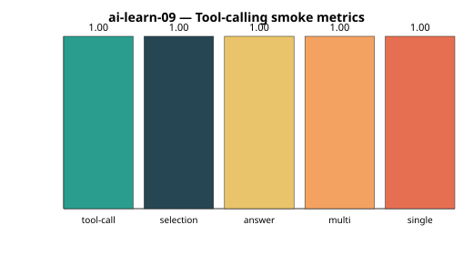
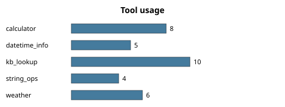
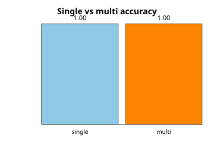

# Results — ai-learn-09-tool-calling-scratch

Smoke run of a **toy ReAct-style tool-calling agent** (heuristic planner, no LLM API).

## Headline metrics

| Metric | Value |
|--------|------:|
| Tasks | 23 |
| Multi-step tasks | 5 |
| Tool-call success rate | 1.0000 |
| Tool-selection accuracy | 1.0000 |
| Answer accuracy | 1.0000 |
| Multi-step answer accuracy | 1.0000 |
| Single-step answer accuracy | 1.0000 |
| Mean tools / task | 1.43 |
| Mean steps / task | 1.43 |
| Runtime (s) | 0.176 |
| Tools registered | 5 |

## Tool usage

- `calculator`: 8
- `datetime_info`: 5
- `kb_lookup`: 10
- `string_ops`: 4
- `weather`: 6

## Plots

## Architecture (smoke)

1. **Registry** — JSON-schema-like tool specs + pure-Python handlers
2. **Planner** — keyword/regex scoring picks 1..N tools + args
3. **Agent loop** — Thought → Action → Observation (ReAct sketch)
4. **Answer** — template synthesis over observations

## Per-task snapshot

| id | multi | tools called | sel_ok | ans_ok |
|----|:-----:|--------------|:------:|:------:|
| calc_add | false | `calculator` | Y | Y |
| calc_mul | false | `kb_lookup, calculator` | Y | Y |
| calc_div | false | `calculator` | Y | Y |
| calc_sqrt | false | `calculator, kb_lookup` | Y | Y |
| calc_pct | false | `calculator` | Y | Y |
| wx_blr | false | `weather, kb_lookup` | Y | Y |
| wx_london | false | `weather` | Y | Y |
| wx_tokyo | false | `weather` | Y | Y |
| dt_weekday | false | `datetime_info` | Y | Y |
| dt_tomorrow | false | `datetime_info` | Y | Y |
| dt_year | false | `datetime_info` | Y | Y |
| kb_rag | false | `kb_lookup` | Y | Y |
| kb_lora | false | `kb_lookup` | Y | Y |
| kb_react | false | `kb_lookup` | Y | Y |
| kb_python | false | `kb_lookup` | Y | Y |
| str_upper | false | `string_ops` | Y | Y |
| str_reverse | false | `string_ops` | Y | Y |
| str_words | false | `kb_lookup, string_ops` | Y | Y |
| multi_calc_wx | true | `calculator, weather` | Y | Y |
| multi_kb_dt | true | `kb_lookup, datetime_info` | Y | Y |
| multi_wx_calc | true | `calculator, weather` | Y | Y |
| multi_str_kb | true | `kb_lookup, string_ops` | Y | Y |
| multi_three | true | `calculator, weather, datetime_info` | Y | Y |
